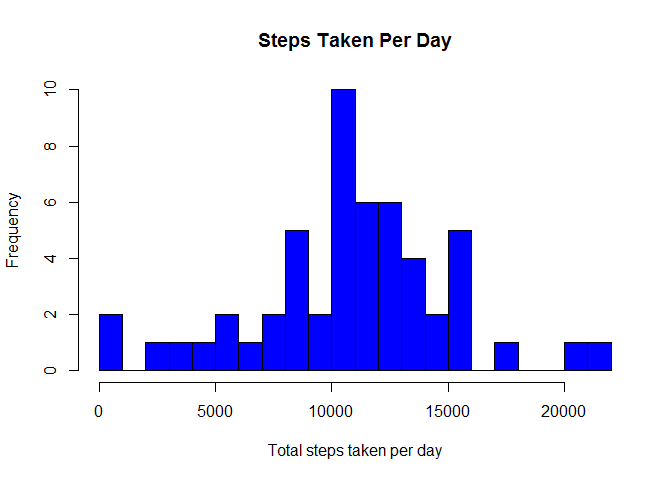
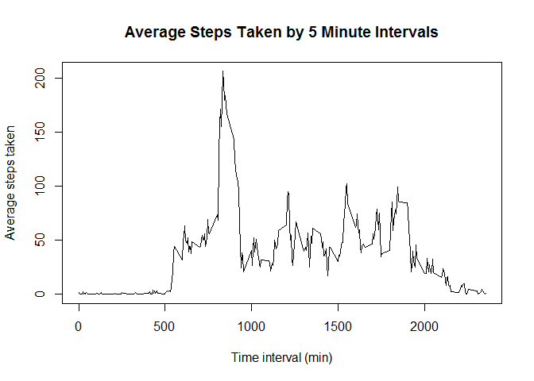
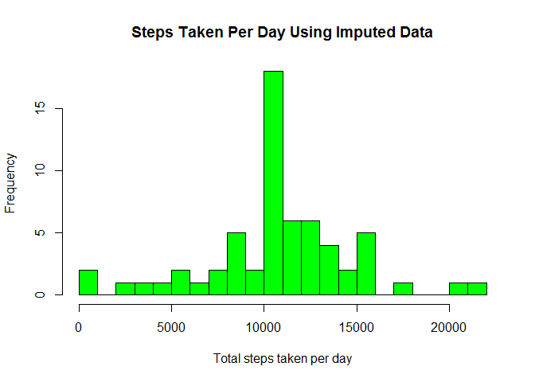
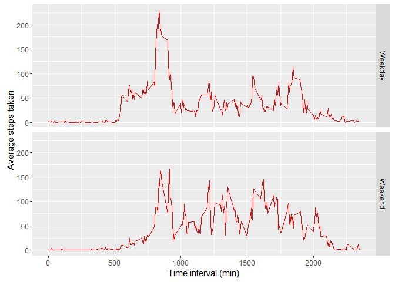

# Reproducible Research: Peer Assessment 1


```r
# Avoid scientific notation when outputting results for readability
options(scipen = 999)
```

## Loading and preprocessing the data

To begin, we have to load the data from the personal activity monitoring device, remove missing data and format the date column.


```r
data <- read.csv("activity.csv")
data.narm <- data[!is.na(data$steps),]
data.narm$date <- factor(data.narm$date)
summary(data)
```

```
##      steps                date          interval     
##  Min.   :  0.00   2012-10-01:  288   Min.   :   0.0  
##  1st Qu.:  0.00   2012-10-02:  288   1st Qu.: 588.8  
##  Median :  0.00   2012-10-03:  288   Median :1177.5  
##  Mean   : 37.38   2012-10-04:  288   Mean   :1177.5  
##  3rd Qu.: 12.00   2012-10-05:  288   3rd Qu.:1766.2  
##  Max.   :806.00   2012-10-06:  288   Max.   :2355.0  
##  NA's   :2304     (Other)   :15840
```


## What is mean total number of steps taken per day?

Using the dataset with removed missing values, we can calculate the average total steps taken per day.


```r
day.sums <- tapply(data.narm$steps,data.narm$date, sum)

hist(day.sums,breaks=25, main = "Steps Taken Per Day", xlab = "Total steps taken per day", col = "blue")
```

<!-- -->

```r
day.mean <- mean(day.sums)
day.median <- median(day.sums)
```

The mean steps taken per day is 10766.19. The median steps taken per day is 10765.


## What is the average daily activity pattern?

The average daily activity pattern can be found by taking the mean of the steps taken in each interval.


```r
interval.means <- tapply(data.narm$steps, data.narm$interval, mean)
plot(names(interval.means), interval.means, type="l", main = "Average Steps Taken by 5 Minute Intervals", xlab = "Time interval (min)", ylab = "Average steps taken")
```

<!-- -->

The interval with the maximum total steps can be found by summing the steps taken in each interval.


```r
interval.sums <- tapply(data.narm$steps, data.narm$interval, sum)
interval.max <- names(interval.sums)[which.max(interval.sums)]
```

The 5-minute interval containing the maximum number of steps is 835.

## Imputing missing values


```r
points.na <- sum(is.na(data$steps))
```

The total number of missing data points in the original dataset is 2304. 

Since the most variation appears to be present from interval to interval (rather than from day to day), each of these missing points will be imputed individually using the mean value of the interval that corresponds to the interval of the missing datapoint.


```r
# Calculate interval means using data with missing points removed
interval.means <- tapply(data.narm$steps, data.narm$interval, mean)

data.imputed <- data

# Loop through entire dataset and impute each data point based on interval mean
for (i in 1:length(data.imputed$steps)) {
     if(is.na(data.imputed[i,1])) {
          interval.mean <- interval.means[rownames(interval.means)==data.imputed[i,3]]
          data.imputed[i,1] <- interval.mean
     }
}

#Calculate total steps taken per day with imputed data
day.sums.imputed <- tapply(data.imputed$steps,data.imputed$date, sum)

hist(day.sums.imputed,breaks=25, main = "Steps Taken Per Day Using Imputed Data", xlab = "Total steps taken per day", col = "green")
```

<!-- -->

```r
day.mean.imputed <- mean(day.sums.imputed)
day.median.imputed <- median(day.sums.imputed)
```

The mean steps taken per day with imputed data included is 10766.19. The median steps taken per day with imputed data included is 10766.19.  

The mean steps taken per day has not changed by imputing the data. This is expected because the imputed data was obtained using mean data from the dataset. The median steps taken per day has increased by 1.1886792 and is now almost the same as the mean. This was also expected because the imputed data was obtained from mean data, increasing the frequency of values at the mean. This can be confirmed by comparing the histogram above to the histogram created in the "Average total steps taken per day" section above. There is a much higher frequency at the centre point of the imputed dataset.

## Are there differences in activity patterns between weekdays and weekends?

To compare weekday and weekend activity, a new factor must be added to the dataset based on the date.

```r
data.imputed$date <- as.Date(data.imputed$date)

# Create factor showing weekday or weekend based on date column
wdays <- c("Monday","Tuesday", "Wednesday", "Thursday", "Friday")
day <- factor(weekdays(data.imputed$date) %in% wdays, levels = c(TRUE,FALSE), labels = c('Weekday','Weekend'))

# Merge with dataset with imputed values
data.imputed <- cbind(data.imputed, day)
head(data.imputed)
```

```
##       steps       date interval     day
## 1 1.7169811 2012-10-01        0 Weekday
## 2 0.3396226 2012-10-01        5 Weekday
## 3 0.1320755 2012-10-01       10 Weekday
## 4 0.1509434 2012-10-01       15 Weekday
## 5 0.0754717 2012-10-01       20 Weekday
## 6 2.0943396 2012-10-01       25 Weekday
```
  
The weekday vs. weekend activity can now be plotted.


```r
library(ggplot2)

ggplot(data.imputed, aes(interval,steps)) + facet_grid(day ~ .) + stat_summary(fun.y = "mean", colour = "red", geom="line") + xlab("Time interval (min)") + ylab("Average steps taken")
```

<!-- -->

As can be seen in the above plots, the weekend activity varies more throughout the day than the weekday activity. This is likely because weekends are often less structured than weekdays for people who attend school or work. Also, the weekend activity appears to start later on in the day, likely due to the same reasons.
